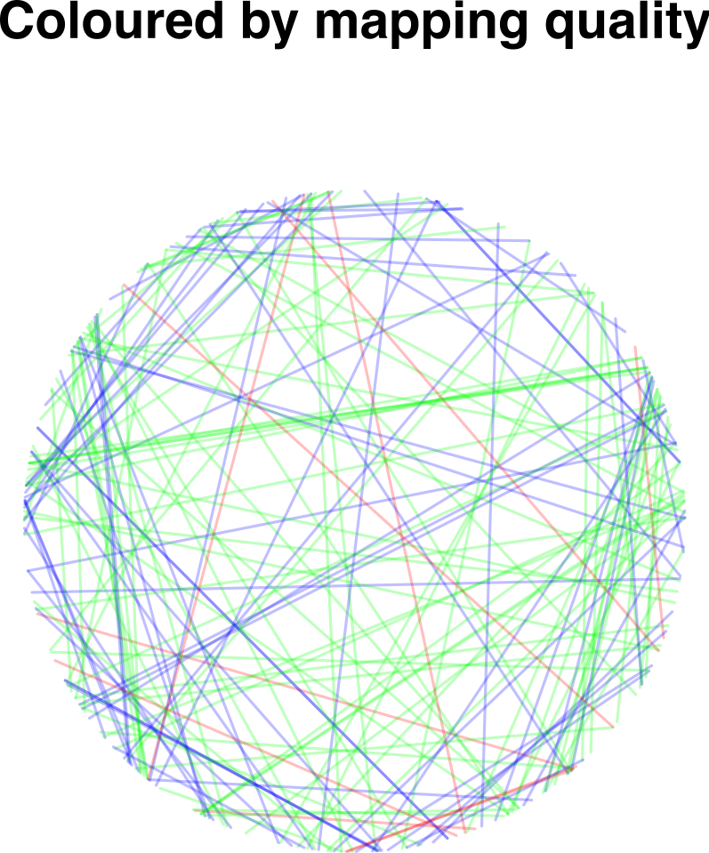
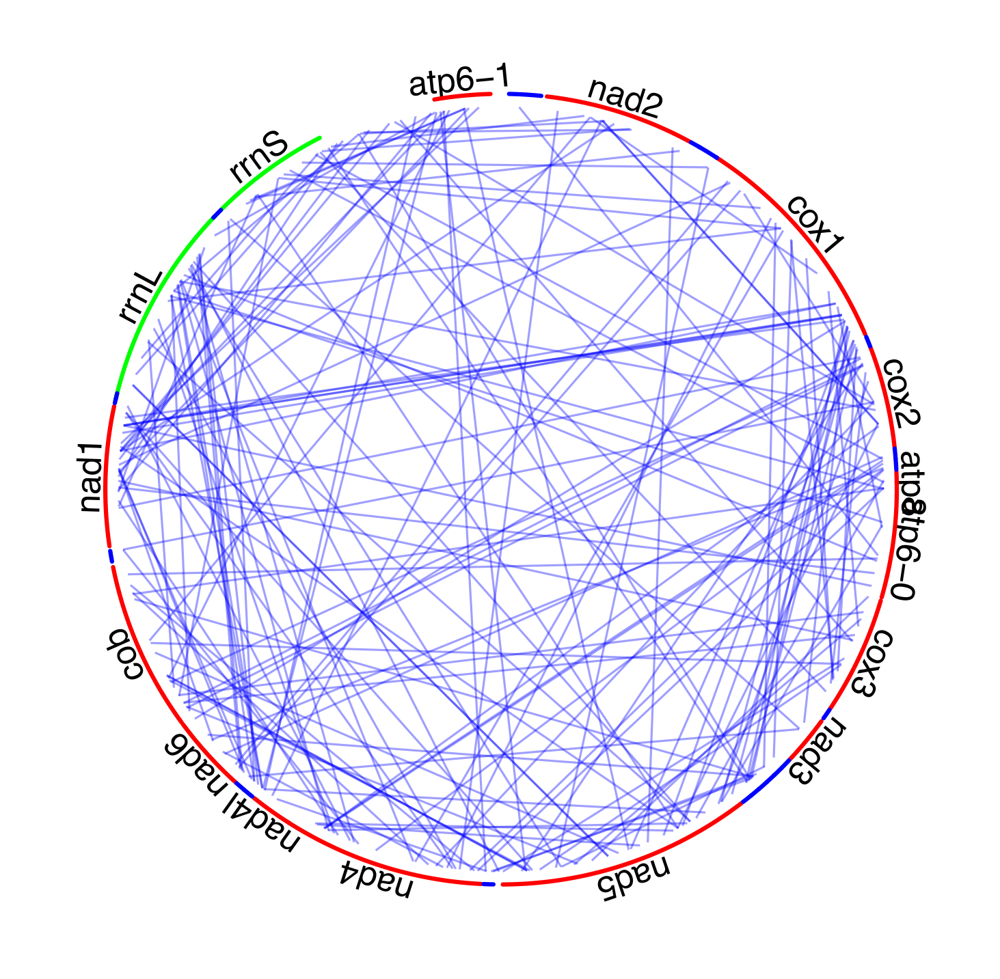

# tangles
*A script to generate* tangle plots *of read-mapping positions with circular references*

Tangle plots are a way of visualising where paired reads map to a cicular reference. This reference may represent a circular genome or a tandem-repetitive DNA sequence. Tangle plots were used by Becher & Nichols (submitted) to visualise paired reads mapping to the mitochondrial genome in the grasshopper *Podisma pedestris*. Many read pairs mapped further apart than expected given their insert size, indicating the presence of rearranged nuclear copies of the mitochondrial DNA (Numts).

## Requirements
Tangle plots can be generated with `R` base graphics (we used `R` version 3.4.4). The `criclize` package is recommended for annotations.

To generate the input file, you will need `bwa`, `samtools`, and the command line utilities `cut` and `gzip`:
1.	Read mapping should be carried out in single-end mode because, when mapping paired reads, `bwa` tries to estimate the insert size from the data and will preferentially place reads at a “reasonable-looking” distance. The output should be a BAM file. Example: `bwa mem -t <no of threads> <reference> <(zcat <read files>) | samtools view -F 4 -b -o <output.bam>`
2.	The BAM file with the mapping results needs to be sorted by read name: `samtools sort -n -@ <no of threads> -o <output.bam> <input.bam>`
3.	From the sorted BAM file, read names, positions, and mapping qualities can be extracted with `samtools` and can be processed with `cut` utility: `samtools view <infile> | cut -f 1,4,14 | gzip > <outfile.gz>`
4.	The actual plots are generated interactively in `R` with the script `tangles.R`. The script contains code to re-plot tangle plots in the Becher & Nichols (submitted, figure 5).

Tangles coloured by average mapping quality:  

Tangle plot annotated with circlize:

